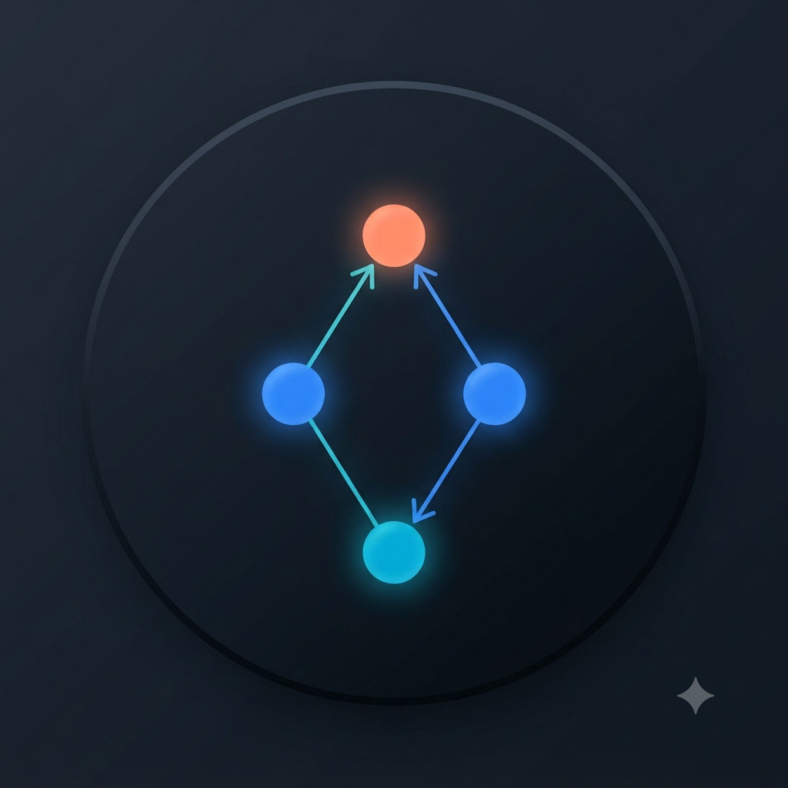
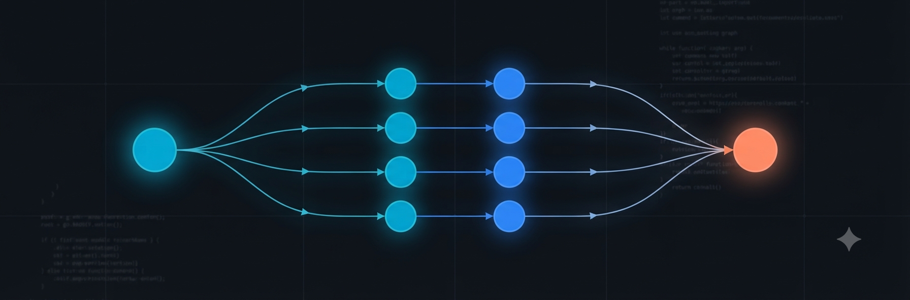
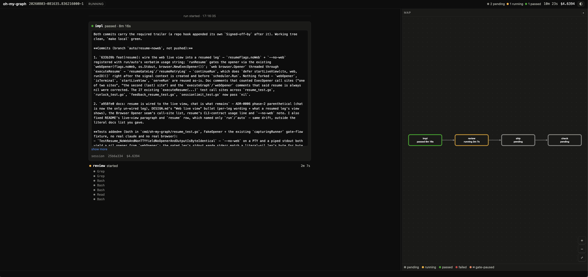
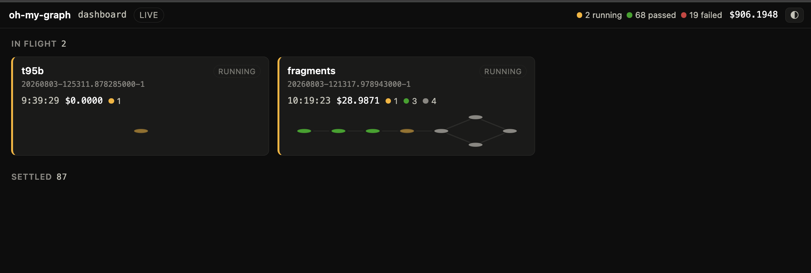

<p align="center">English | <a href="README.ko.md">한국어</a></p>

<p align="center">
  
</p>

<h1 align="center">oh-my-graph</h1>

<p align="center"><em>Describe the goal — it runs the graph, on your Claude subscription.</em></p>

<p align="center">
  <a href="https://github.com/jitokim/oh-my-graph/releases"></a>
  <a href="LICENSE"></a>
  <a href="go.mod"></a>
  
</p>

<p align="center">
  
</p>

> A graph-native multi-agent orchestrator whose node runtime is your own
> logged-in `claude` CLI — not the Anthropic API.

<p align="center">
  
</p>
<p align="center"><em>The live view mid-run — a real dogfood run (the ADR-0012 skill-mapping graph) captured live: node output feed on the left, the DAG map on the right, cost and elapsed time in the header.</em></p>

## What it is

Graph engineering — wiring specialized agents together as a DAG — currently
forces you onto the Anthropic API, the Agent SDK, and a metered
`ANTHROPIC_API_KEY`. Every existing graph-native orchestrator bills per token.

There is no orchestrator that drives the **subscription** `claude` CLI. That is
the gap oh-my-graph fills: you describe the work as a DAG, and each node runs as
a raw `claude -p` subprocess on the subscription you already pay for
([Bring your own login](#bring-your-own-login) has the plan and credential
detail).

How oh-my-graph compares to its nearest neighbours — conductor, OMK,
open-multi-agent — is surveyed in [docs/PRIOR-ART.md](docs/PRIOR-ART.md).

## What it can do

- **The engine.** A graph is YAML — a list of nodes whose edges are inline
  `depends_on` ids — and each node is one `claude -p` subprocess under its own
  tool ceiling (`allowed_tools`, `permission_mode`), with parallelism emerging
  from the topology up to a concurrency cap. Exactly four objects in the whole
  codebase may spawn a process, and every one of them starts its child from an
  environment with `ANTHROPIC_API_KEY` and `ANTHROPIC_AUTH_TOKEN` deleted
  ([the graph model](#the-custom-path--write-the-graph-yourself) ·
  [DESIGN.md](DESIGN.md) ·
  [ADR 0002](docs/adr/0002-verification-is-a-second-exec-seam.md) ·
  [ADR 0005](docs/adr/0005-worktree-provisioning-is-a-third-exec-seam.md) ·
  [ADR 0006](docs/adr/0006-browser-open-is-a-fourth-exec-seam.md)).
- **Failure is a first-class grammar.** A node passes on evidence, not on
  self-report: `success_check` with an engine-run `verify` command, per-cause
  `retry`, graph-level `on_fail`, bounded `feedback:` review loops, `auto`'s
  plan→run→assess goal cycles, human gates, and a subscription session limit
  that pauses the run instead of failing it — `resume --retry-failed` later
  finishes exactly the work that never ran
  ([what else a node can declare](#what-else-a-node-can-declare)).
- **Observation.** A web live view served on `127.0.0.1` while a leg runs —
  or `serve` with no run id for a dashboard of every run at once, one live
  mini-DAG card each — then `runs list` / `show` / `watch` afterward, over an
  append-only `events.jsonl` any consumer can tail — plus a per-node cost
  ledger with a run total
  ([Usage](#usage) · [docs/RUN-FEED.md](docs/RUN-FEED.md)).
- **Your own Claude setup.** Nodes are the `claude -p` you already log into, so
  they inherit it; `agent:` runs a node as one of your own Claude Code
  subagents, and `auto` maps planned nodes onto your agents and skills
  ([`auto` in depth](#auto-in-depth)).

<p align="center">
  
</p>
<p align="center"><em>The dashboard, one step up from a single run — a real dogfood board: every card is a real run of this repository's own development. The <code>$906.1948</code> in the header is cumulative subscription usage across the project's whole development — not a per-run price, and not free.</em></p>

## What makes it different

- **The graph is an artifact, not a transcript.** The DAG lives in a YAML file
  you version, review in a pull request and replay — the same topology, the same
  tool ceiling, the same prompts every time. That is the opposite of an agent
  improvising a fresh plan, or writing a fresh throwaway script, on every
  invocation.
- **A human can stand in the middle of the run.** A `type: gate` node stops the
  run for approval and `oh-my-graph resume` continues it — from the terminal or
  straight from the live view — so an irreversible step waits for a person
  instead of for the best case.
- **Failure semantics live in the engine, not in your glue code.** Evidence
  checks, per-cause retry, continue-or-halt policy, bounded feedback loops, gate
  pauses and failed-run salvage are behaviour you declare in the graph, not
  shell you write and maintain around it.
- **It ships itself.** Dogfooding here is not a demo: this repository is built
  by the tool it contains. Features, fixes, docs and releases are authored by
  its own graphs — a claude node implements on a branch, sibling nodes run the
  checks and the reviews, and a final node opens the draft PR. The verifiable
  part — a snapshot taken 2026-08-06, and it only goes up: 49 of the 114 pull
  requests merged into `main` carry a Claude co-author trailer in their squash
  commit, the receipt that a claude session wrote them. Don't take the
  snapshot's word for it, count today's number yourself:
  `git log main --first-parent -i --grep="co-authored-by: claude"` (50 matches
  at that snapshot: those 49 squash commits plus the initial commit). That
  trailer names the model, not the pipeline, so from 2026-08-02 on, commits
  authored by a graph lane also carry
  `Co-Authored-By: oh-my-graph <graphs@oh-my-graph.dev>` — a
  transparency convention, not proof of authorship; see
  [CONTRIBUTING.md](CONTRIBUTING.md#attribution). The templates in
  [`graphs/`](graphs/) are not samples: `self-dev.yaml`, `adr-driven-dev.yaml`
  and `apply-flags.yaml` are the pipelines this repo ships itself with, and a
  full dogfooding run is walked through in
  [docs/EXAMPLES.md](docs/EXAMPLES.md#dogfooding-developing-oh-my-graph-with-oh-my-graph).

## How to use it

Two paths, both runnable in a minute: let `auto` plan the graph from a
plain-language goal, or write the YAML yourself when you want precise control.

<a id="quickstart"></a>
<a id="example"></a>

### The easy path — install, `init`, state a goal

```sh
go install github.com/jitokim/oh-my-graph/cmd/oh-my-graph@latest

# Write the example graphs that ship inside the binary into ./graphs/:
oh-my-graph init

# Zero config — describe the goal and let auto plan the graph:
oh-my-graph auto "lint this repo and summarize the findings" --input repo=$PWD

# See what that would do first — prints the plan, runs no node:
oh-my-graph auto "lint this repo and summarize the findings" --plan-only

# Or run a shipped graph — the cheapest real smoke test (a few cents):
mkdir -p /tmp/omg-smoke
oh-my-graph run graphs/haiku-smoke.yaml --input dir=/tmp/omg-smoke
```

`go install` copies one executable and nothing else, so `init` unpacks the
example graphs embedded in that executable into `./graphs/` — including
`./graphs/fragments/`, the shared node shapes three of those templates cite
with `use:`, without which they would not load. Pass a directory
(`oh-my-graph init <dir>`) to write to `<dir>/graphs/` instead. It never
overwrites: a file that is already there is kept exactly as it is and named on
stdout as kept, and only the payload files that are missing are written — so
re-running `init` is also how you collect a template or fragment a later
release added, without your edits being touched. A kept file whose bytes
differ from the binary's copy is marked `DIFFERS`, so a tree carrying an old
fragment under a freshly written template is visible in the listing rather
than something you find out about at load time.

No `ANTHROPIC_API_KEY` needed — the smoke test runs on your logged-in `claude`
subscription; if the key (or `ANTHROPIC_AUTH_TOKEN`) is set in your shell,
it's deleted from each node's subprocess environment before that node runs
(see [Bring your own login](#bring-your-own-login) below).

`auto` is the zero-config default: one claude call (through the same
subscription-auth, env-scrubbed runner) turns the goal into a graph spec, which
is validated and executed by the same engine. The plan is printed before it
runs, and the generated spec is saved to
`~/.oh-my-graph/runs/<run-id>/graph.json` — since JSON is valid YAML you can
hand-edit it and re-run it with `oh-my-graph run`. A planned node can never use
`permission_mode: bypassPermissions`; custom YAML remains the path for precise
control.

Want to read that plan *before* anything executes? `--plan-only` prints it —
the graph, every agent mapping, the staged skill corpus, the tool ceiling — and stops without
running a node. Unlike `run --dry-run` it is not free: there is no plan to show
until a planner call has been made and paid for, so it prints what that cost
and keeps the plan it bought. Its knobs — goal cycles, agent mapping,
skill activation, and what `--plan-only` does with the plan afterwards — are in
[`auto` in depth](#auto-in-depth) below.

While a graph runs you'll see a live line per node — `▶ write  running…`, then
`✓ write  PASS  $0.0091  4.2s` — the terminal is never silent during a
multi-node run. At the end you get a ledger: one row per node (session id,
cost, verdict, detail) and the total cost. The shipped
`graphs/haiku-smoke.yaml` above (two nodes: `write` then `critique`, wired by
the default artifact handoff) is the cheapest real end-to-end check of all of
it:

```text
Running graph "haiku-smoke" (run 20260729-101532)

▶ write  running…
✓ write  PASS  $0.0091  4.2s
▶ critique  running…
✓ critique  PASS  $0.0034  2.1s

Run 20260729-101532 — 2 node(s)
NODE             VERDICT              SESSION                   COST(USD)  DETAIL
---------------------------------------------------------------------------------
critique         PASS (exit-only)     a1b2c3d4-e5f6-47a8-9…        0.0034
write            PASS (verified)      f9e8d7c6-b5a4-4321-8…        0.0091
---------------------------------------------------------------------------------
TOTAL COST: $0.0125
```

Every `PASS` says **how** it was reached, because "the engine ran your build
and it exited 0" and "the model said the word PASS" are not the same claim and
must not print as the same word. `write` declares a `success_check.verify`, so
its row is `verified`; `critique` declares only `exit_zero`, so nothing beyond
the process's exit status was checked and its row says so. The four qualifiers
are a closed set:

| qualifier | what the engine actually did |
|---|---|
| `verified` | ran a `success_check.verify` command and judged its exit code (and `output_matches`, when declared) |
| `self-reported` | matched a `result_matches` pattern against what the node *said* — no state outside the model's narration was observed |
| `exit-only` | the subprocess exited 0, and no predicate beyond that was declared |
| `approved` | a human approved a `type: gate` node — no subprocess, no predicate |

`verified` means *measured*, not *correct*: `verify: { command: "true" }`
yields it. The ledger reports how a verdict was reached, never whether the
check was a good one. A `FAIL` carries no qualifier — it states its cause in
`DETAIL` instead.

Which qualifier a node can earn depends on the path. A hand-written graph earns
`verified` by declaring `success_check.verify` — your own reviewed artifact,
your own command. A **planned** node cannot: a planner-authored `verify:` is
engine-run shell outside every ceiling layer, so it is refused outright, which
is why `auto`'s check nodes have only ever been able to reach `self-reported`.
That is the gap
[ADR 0016](docs/adr/0016-build-evidence-is-a-user-supplied-engine-command.md)
closes — a build command **you** supply at invocation, attached by trusted code
to the plan's sink nodes *after* validation and run by the engine, so a
verification node cannot pass a branch that does not build:

```sh
oh-my-graph auto "fix the failing spec" --verify-cmd './gradlew build'
```

The engine runs that at every sink node of the plan, one at a time, after the
node's own subprocess — and a sink that fails it fails the run. Your nodes are
granted nothing by it: the command is yours, the engine runs it on its own
verify seam, and it judges the exit code itself. `--verify-timeout` bounds one
execution (10 minutes by default, which is also the ceiling — not the 2-minute
default a hand-written check gets, because a cold Gradle or Cargo build is
exactly what that default was not sized for). A plain program invocation that
cannot run is refused **before** the planner call, so a typo costs nothing — a
command carrying shell syntax (a pipe, an `&&`, a substitution) skips that
check rather than have the pre-flight re-implement the shell. `--plan-only`
prints the command and the sink nodes it will run at, so you can see it before
buying the run, and every cycle of a `--max-cycles` goal loop plans a new graph
that carries it. With no `--verify-cmd`, `auto` prints what it is *not*
checking — and, if it recognizes the project, the flag that would change that.
[SECURITY.md](SECURITY.md) has the standing such a command has. One cost worth
knowing up front: a run started with `--verify-cmd` cannot be `resume`d, which
refuses every verification it finds in a run directory rather than replay one
on trust.

When stdout is a terminal, `run`, `auto` and `resume` also serve the [web live
view](#usage) of the leg they are starting on an ephemeral `127.0.0.1` port and
open it in your default browser; the server lives exactly as long as that leg.
In a script, a pipe, or CI (stdout not a terminal) — or with `--no-web` —
nothing is served or opened and the output is unchanged.

To watch runs that are already going, run `oh-my-graph serve`. With no run id
it is a **dashboard** — the board pictured above: one port, one tab, one live
mini-DAG card per run — in-flight runs first with their state, elapsed, cost
and node counts, settled runs collapsed below — and clicking a card opens that
run's full live view. Cards appear and settle live, so a run started after you
opened the page shows up on it. It opens in your browser too (on a terminal;
`--no-open` opts out), and `oh-my-graph serve <run-id>` still goes straight to
that one run's view. Unlike the embedded live view above, `serve` is the thing
you asked for: in a script, a pipe, or CI it still binds the port and serves —
it just opens no browser, and its output is unchanged.

More walkthroughs — auto mode in depth, dogfooding, watching a run as it
happens, ambient chat — plus per-feature recipes live in
[docs/EXAMPLES.md](docs/EXAMPLES.md).

### Prebuilt binaries

Each tagged release also publishes prebuilt binaries on the [GitHub Releases
page](https://github.com/jitokim/oh-my-graph/releases) — darwin and linux, on
both `arm64` and `amd64`, as `.tar.gz` archives with a `checksums.txt` next to
them. An alternative to `go install` when you'd rather not keep a Go toolchain
around. There's no Homebrew tap, and Windows is not in the build matrix — build
from source there.

Pick a tag from the Releases page, then:

```sh
VERSION=0.5.4 OS=darwin ARCH=arm64   # the tag (without the leading v) and your platform
ARCHIVE="oh-my-graph_${VERSION}_${OS}_${ARCH}.tar.gz"
curl -sSfLO "https://github.com/jitokim/oh-my-graph/releases/download/v${VERSION}/${ARCHIVE}"
curl -sSfLO "https://github.com/jitokim/oh-my-graph/releases/download/v${VERSION}/checksums.txt"
grep " ${ARCHIVE}$" checksums.txt | shasum -a 256 -c -   # on linux: sha256sum -c -
tar xzf "${ARCHIVE}"
./oh-my-graph version
```

Move `oh-my-graph` onto your `PATH` and the smoke test above runs unchanged.

### The custom path — write the graph yourself

A graph is YAML: a `name`, optional `inputs` and `concurrency`, and a list of
`nodes`. Each node is one `claude -p` subprocess. Edges are inline `depends_on`
ids — there is no separate edge list, so the topology has a single source of
truth. Parallelism is **emergent**: nodes that share a parent but don't depend
on each other run concurrently, up to the cap.

```yaml
name: dev-review-pr
inputs: [repo]
concurrency: 4
nodes:
  - id: dev
    cwd: "{{ inputs.repo }}"
    prompt: Implement the change and summarize what you did.
    allowed_tools: [Read, Edit, Write, "Bash(git *)"]
    permission_mode: dontAsk

  - id: e2e
    depends_on: [dev]
    cwd: "{{ inputs.repo }}"  # a session child works in its parent's tree
    handoff: session          # e2e resumes dev's session — it already knows everything dev just did
    prompt: >
      Run make local. If it passes, your whole reply is the four bare
      characters PASS and nothing else (`**PASS**` is WRONG); otherwise
      start with FAIL and say what broke.
    success_check:
      exit_zero: true
      result_matches: '^[*_`\s]*PASS[*_`\s]*$'   # what the node said — anchored, see DESIGN.md "Verdict patterns"
      verify: { command: "make local" }          # what the engine saw
    retry: { max: 1, on: [nonzero_exit, verify_failed] }

  - id: review
    depends_on: [e2e]
    permission_mode: plan     # read-only
    allowed_tools: [Read, "Bash(git diff*)"]
    prompt: "Review the diff. e2e said: {{ artifacts.e2e | inline }}"
```

**What `allowed_tools` buys you.** It is the node's own grant, not a hint: a
node that omits it inherits your Claude Code settings, so a tool you have not
pre-authorised there is a tool the node cannot use. Nothing fails loudly — the
node explains the denial in prose and finishes, and a check like
`result_matches: '^DONE'` passes on that prose. Name what each node needs; where
the work must be visible outside the node's own reply, add a
`success_check.verify` command, which the engine runs itself. A node that
reaches for nothing at all — one that only judges or summarises what it was
handed — says so with an empty grant, `allowed_tools: []`.

Three things worth knowing about from the start, each one line of YAML:

- **gates** — a node declared `type: gate` stops the run for human approval,
  continued with `oh-my-graph resume`
  ([spec](DESIGN.md#gate-nodes-and-resume-v11)).
- **`feedback:`** — `feedback: { rerun: impl, max: 2 }` on a reviewer node
  turns a review into a bounded loop instead of an unrolled chain
  ([ADR 0010](docs/adr/0010-a-feedback-edge-is-a-bounded-runtime-rerun-not-a-static-cycle.md)
  · demo: `graphs/review-loop.yaml`).
- **`worktree:`** — parallel edit lanes, one isolated git checkout per lane name
  ([recipe](docs/EXAMPLES.md#parallel-edit-lanes-with-git-worktrees-worktree)).

The full field list is in [what else a node can
declare](#what-else-a-node-can-declare) below; DESIGN.md is the authoritative
spec.

### Recurring pipelines — write it once

A graph file is your prompt engineering, saved. The careful
goal/format/rules prompt you would otherwise re-type into a chat every
morning lives in the YAML once, and `oh-my-graph run pipeline.yaml` replays
it identically on demand — daily analysis, weekly triage, release checks —
on the subscription you already pay for. Within one run, `handoff: session`
keeps the chain's context flowing, so downstream prompts stay one-liners
instead of restating the goal and the format — see
[Handoff](#handoff--what-a-child-inherits) below.

```yaml
name: daily-triage
nodes:
  - id: collect             # the careful goal/format/rules prompt lives here, once
    # what it collects with — undeclared is undelivered, and the two reads it
    # needs are all it gets: no mutating `gh` form is in reach
    allowed_tools: ["Bash(gh issue list *)", "Bash(gh pr checks *)"]
    prompt: >
      Collect today's open issues and failing checks; list each with a
      one-line status.
  - id: analyze
    depends_on: [collect]
    handoff: session        # continues collect's conversation
    allowed_tools: []       # reasons over what collect already put in the session
    prompt: Analyze what you just collected and rank by urgency.
  - id: report
    depends_on: [analyze]
    handoff: session        # the chain keeps flowing
    allowed_tools: []       # the reply IS the report
    prompt: Write the ranked findings up as a short report.
```

One boundary, stated plainly: **runs do not remember each other.** Each run
starts fresh by design
([ADR 0008](docs/adr/0008-cross-run-session-reuse-is-deferred.md) records
why cross-run session reuse is deferred) — day-to-day consistency comes
from the pinned prompts and the `success_check` / `verify` gates, not from
Claude remembering yesterday.

## Usage

```text
oh-my-graph <init|run|auto|lint|chat|resume|runs|show|watch|serve|version> ...
```

| subcommand | purpose |
|---|---|
| `init [dir]` | Write the example graphs embedded in the binary to `<dir>/graphs/` (`dir` defaults to `.`), including the `fragments/` subdirectory the templates cite with `use:`, listing each file as `wrote` or `kept`. Never overwrites — an existing file is kept untouched and reported, and only the missing ones are written, so re-running `init` tops a tree up with whatever a later release added. |
| `run <graph.yaml>` | Execute a hand-written DAG — the precise-control path. `--dry-run` validates, resolves `--input` interpolation, prints the plan, runs nothing. |
| `auto "<goal>"` | Plan a DAG from a plain-language goal, then execute it with the same engine — the zero-config default. `--plan-only` prints the plan, its agent mappings, its staged skill corpus and the tool ceiling, then stops without running a node (it still pays for at least one planner call, and a validation refusal buys one corrected call on top of it — unlike `run --dry-run`, it is not free). `--max-cycles N` iterates plan→run→assess up to N times — a validation-refused plan buys one corrected planner call, so the planner-call worst case is `2 × N` (`--max-goal-budget-usd` adds a soft spend ceiling between cycles; requires `--max-cycles` of 2 or more). `--verify-cmd 'CMD'` attaches your own build command to the plan's sink nodes for the ENGINE to run and judge, so a check node cannot certify a branch that does not build; `--verify-timeout D` bounds one execution (default and ceiling 10m). A run started with `--verify-cmd` cannot be resumed. |
| `lint <graph.yaml>` | Statically validate a graph file, reporting every problem at once. Read-only, zero cost. |
| `chat` | Interactive REPL (prototype): conversational turns are answered, task-shaped turns are planned into a graph and run. |
| `resume <run-id> ((--approve \| --reject) <gate-id> \| --retry-failed)` | Resume a run: decide the gate it is paused at, or `--retry-failed` to salvage a failed run — passed nodes' results are kept and only the failed and cancelled nodes re-execute. Takes `--concurrency N` and `--no-web`. |
| `runs list` | List runs, newest first: graph name, node count, cost, verdict (`PASS`, `FAIL`, `RUNNING`, `ABANDONED`), plus a total. Read-only. |
| `show <run-id>` | Print one run's per-node ledger (session, cost, verdict, duration) and the total. Read-only. |
| `watch <run-id>` | Tail a run's event stream as plain text, `tail -f` style. Read-only. |
| `serve [<run-id>]` | Web live view, bound to `127.0.0.1` only (default port 8642, `--port` to change). With **no run id** it is a dashboard: one live mini-DAG card per run, each card opening that run's view at `/run/<id>/`. With a run id it goes straight to that run. Opens in your browser when stdout is a terminal; `--no-open`, a pipe, or CI prints the URL and serves it without opening anything. Read-only except for one thing: a run paused at a gate can be approved or rejected from the page. |
| `version` | Print the tool version. |

`run` and `auto` share `--input k=v` (repeatable), `--concurrency N` (ceiling
10), `--continue-on-fail`, and `--no-web` (do not serve or open the web live
view for this run). Both print a live per-node feed as the graph
executes, then a cost ledger. A graph can also declare the failure policy
itself with graph-level `on_fail: continue` (default `halt`) — the right
default for a batch of independent lanes, where one lane's failure should
not cancel the others' in-flight work. The flag ORs with the field: either
saying continue means continue.

`lint` checks structure — DAG/cycle, unknown `depends_on` ids, the
session-handoff parent rule, verify blocks — and exits 0 when valid, 1 when
not. On a valid graph it also prints advisory `warning:` lines to stderr for
placeholder-like `{{ ... }}` tokens that won't resolve — a typoed filter
(`| inlin`), a singular `{{ artifact.x }}`, an undeclared input, or an
`artifacts.<id>` naming a node that doesn't exist or isn't an ancestor —
plus, for a `handoff: session` node, a `cwd`/`worktree` that differs from
its session-parent's, or a `retry` block (a retried attempt starts cold) —
plus, for any node, a verdict nothing reads: a prompt that demands a token
(`START your reply with …`) under a `success_check` with no `result_matches`,
or a `result_matches` written without `exit_zero` (which drops the exit-code
guard a node has for free only while it declares no check at all) —
plus, for a node that declares neither `allowed_tools` nor a
`success_check.verify`, that nothing it does can observe a tool denial: a tool
your Claude Code settings do not pre-authorise is refused, the node says so in
prose, and its own `result_matches` is free to pass on that prose. Name the
tools the node needs (`allowed_tools: []` if it needs none), or give it a
`verify` command the engine runs itself. (A gate node and a
`permission_mode: bypassPermissions` node are exempt: neither can be denied
anything.)
Warnings never change the exit code. At run time, malformed tokens pass
through verbatim (a prompt may legitimately contain literal `{{ }}` text),
while a well-formed reference to an unbound input or unknown node fails
its node when interpolation runs.
`run --dry-run` shares that exit contract and the same warnings, and
additionally proves `{{ inputs.* }}` resolution against your actual
`--input` values. An
in-flight run shows in `runs list` as `RUNNING` (with `-` placeholders until
its first snapshot lands).

A run whose process died — a closed terminal, a `kill -9`, an OOM — used to
read `RUNNING` forever, because a killed leg never writes the event that would
end it. It now reads **`ABANDONED`** instead. Liveness is the kernel's
`flock(2)` on the run's `resume.lock`, so a held lock means a live leg and a
dead one releases it however it died; the state is derived when you read it,
never repaired into the event stream, and it is one rule shared by `runs list`,
the dashboard, the single-run view and `watch`, so they cannot disagree
([ADR 0015](docs/adr/0015-an-abandoned-run-is-derived-from-the-lock-not-repaired-into-the-feed.md)).
`ABANDONED` is deliberately not `FAIL` — the work never got a verdict. Every
surface carries the same recovery hint, and the hint carries a warning worth
reading before you act on it: the engine spawns each `claude` in its own process
group, so **the death that abandoned the run may have left a subprocess still
running and still spending**. Check for one before you resume, or you will pay
for the same node twice. A run that died before its first node settled wrote no
snapshot, so there is nothing to resume from and its hint says to run the graph
again instead. Any doubt — an unreadable lock, a network filesystem, a
pre-`flock` lock file whose pid still names some process or cannot be read at
all — reads as in-flight, never as abandoned: a false "dead" would authorise a
second scheduler over a live run. A pre-`flock` file is the one carrying no
`flock` to ask, so its pid line is read in a single direction instead: a pid
naming no process at all is free, and only that — beside an open leg — reads as
abandoned.

<a id="auto-in-depth"></a>

### `auto` in depth — goal cycles, agents, skills

Want `auto` to keep going until the goal is actually met? `--max-cycles N`
(default 1) turns one invocation into a bounded loop of up to N whole
plan→run→assess cycles: after each run, a tool-stripped assessor judges the
goal against the run's own recorded evidence, and if work remains, the next
cycle replans around it — every cycle re-validated under the same tool
ceiling, every plan and verdict printed as it happens, and a goal summary
totalling each cycle's spend at the end. Exit 0 requires both a goal-met
verdict and a passed final run. `--max-goal-budget-usd X` adds an optional
soft spend ceiling checked between cycles; it requires `--max-cycles` of at
least 2, since a single-cycle run has no cycle boundary to check it at, and
the flag is rejected at parse otherwise. Stated honestly: `auto` is
non-interactive, so an unattended `--max-cycles 5` may spend **up to ten**
planner calls — a validation refusal buys one corrected plan, so each cycle's
planner-call worst case is 2, and `--max-cycles` itself has no upper bound —
five graphs and five assessments with nobody watching — the
governance is the bound you typed, the per-cycle validation, and the printed
record, not a confirmation prompt.

If you have your own Claude Code agents (`~/.claude/agents`, `./.claude/agents`
— project wins), `auto` also maps planned nodes onto them when a node's id
clearly matches an agent's name — your review node runs as *your*
`code-reviewer`. The match is deliberately conservative (one clear candidate or
nothing, and an agent wanting tools beyond the node's planned allowlist is
skipped with a note), every mapping is shown in the printed plan before
anything runs, and `--no-agent-mapping` turns it off. The trade, stated
up front: a mapped node loads your settings so the agent can resolve, instead
of running fully settings-isolated — its declared tool list still binds.

Want to see all of that before you let it run? `auto --plan-only` plans, prints
the graph with every agent mapping, the staged skill corpus and the tool ceiling, and stops —
no node is executed. It is the `auto` counterpart to `run --dry-run` with one
honest difference: a dry run reads a file you already wrote and costs nothing,
while there is no plan to inspect until one has been bought, so `--plan-only`
still pays for the planner call and prints what it cost. The plan it
paid for is kept — under `~/.oh-my-graph/plans/<id>/graph.json`, not in
`runs/`, because nothing ran: a preview is not a run, so `runs list` and
`serve` never see it. Run it later with `oh-my-graph run <that path>`.

One planner call is the normal case, and two is the bound: if the planner's
reply describes a graph the validator refuses, oh-my-graph hands those exact
refusals back and buys **one** corrected attempt, held to the identical
ceiling — no auto-editing of what the model wrote, and no third try. The
printed price is the sum of both calls and the re-plan is disclosed on its own
line, with the refusals that caused it. If the corrected reply is refused too,
the rejected spec is still kept — at `~/.oh-my-graph/plans/<id>/rejected.json`
— so a paid-for plan is never destroyed by being invalid. It
previews one cycle by definition — `--plan-only` with `--max-cycles` above 1 is
rejected at parse, since every cycle after the first is planned from the
previous cycle's run and so does not exist yet to be shown.

Your Claude Code skills (`~/.claude/skills` only) reach `auto` runs too, and
they reach them through Claude Code's own activation rather than through a
guess made for the node: `auto` copies your whole skill corpus into a plugin
directory it owns (`~/.oh-my-graph/runs/<run-id>/skills-plugin/`), passes each
**activation-eligible** planned node `--plugin-dir <that>` and adds `Skill` to
its tool list, so the node's own model *can* pick the skill its task calls for,
by description, at run time. Eligible means a planned node that is not
agent-mapped, on a run where activation is on at all — an empty or missing
`~/.claude/skills`, or a staging failure, turns it off for the whole run and
says so on its own line. An **agent-mapped node is excluded** and gets neither
half, because running as one of your subagents already means loading your
settings to resolve the agent, and `--agent` plus a staged plugin plus your
settings is a combination nothing here has measured.

**What that exclusion costs is not small, and the plan printout now says so.**
An excluded node holds no `Skill` tool, so it invokes **no skill at all** — not
the staged corpus, and not your own installed skills either, even though its
settings do load. Measured 2026-08-09 on 10 real spawns: told outright to use a
skill it fired 0 of 3 under the argv oh-my-graph really sends, and 3 of 3 with
`Skill` added to that argv's `--tools` and nothing else changed — and 0 of 1
against 1 of 1 when the skill sat in `~/.claude/skills` rather than in the
project
([the record](docs/measurements/0017-agent-mapped-nodes-cannot-invoke-a-skill.md)).
And the exclusion is not spread evenly: agent mapping runs first and matches on
the same signal, so it takes the design, doc and review nodes — the ones a
procedure fits best. If you would rather those nodes kept the skill surface
than gained a subagent, `--no-agent-mapping` is the switch — it turns agent
mapping off for the whole run, so the price is every mapping the plan would
have made; there is no per-node opt-out. Lifting the exclusion
itself needs its own measurement first, which is
[ADR 0017's (j)](docs/adr/0017-planned-nodes-get-skill-activation-not-inlined-skill-text.md).

**Whether it does is now measured; whether the result is worth the tokens is
not, and the feature is on by default.** v0.5.1 shipped this recording **1
skill invocation across 7 activated planned nodes**, cause unknown. 44 real
spawns against the exact argv an activated node receives say why: under the
planner's own prompt, verbatim, a node reached for a skill **0 times in 9** —
not because nothing fit, but because the gate is a threshold on how directly a
description's trigger language matches the task, applied without deliberation.
So `auto` now appends one fixed sentence to every **activated** node's prompt,
naming no skill and no directory: *"A corpus of procedures is available through
the Skill tool; consult it if one fits this task."* The same prompt bytes with
that sentence fired **8 of 9**, and all 8 chose the same real skill of the
user's own corpus. It is prompt text and not a grant, and it is deliberately
**not** written into a saved `graph.json` — that artifact re-runs through
`run`, which has no staged corpus to promise.

That number is a probe, and it is not a claim that the work got better. On the
one task where the deliverable could be checked mechanically the two arms were
indistinguishable, while the arm with the sentence cost **$0.205 a spawn
against $0.134**; and a node whose prompt is an output contract (a verification
node's `PASS`/`FAIL`) does not activate with it or without it. ADR 0017 is
`Proposed` for that reason, and the numbers are printed with the price before
every run. If you would rather not pay a per-invocation token tax for a
capability whose value is still unmeasured, `--no-skill-activation` is the
switch.

The tool ceiling does not move for it. Activation-eligible planned nodes still
load none of your settings, CLAUDE.md, hooks or MCP servers, and a declared
scope like `Bash(git *)` is still enforced — the only change is that the `Skill`
tool now exists for them. (An agent-mapped node still loads your settings, as it
did before ADR 0017, and is excluded from activation for that very reason — it
does not get the `Skill` tool either way, so those settings buy it no skill.)
What that costs is printed before the run: every staged skill
with its size and SHA-256, and the prompt tokens the corpus adds to **every**
activation-eligible node invocation of that leg, including retries and feedback
re-runs.

What the plan can no longer tell you is *which* skill a node will use — nothing
knows that before the model does. The printout says so, and each invocation is
recorded in that node's ordinary session transcript. The staged directory is
re-created and verified from a manifest before every node spawn of the leg that
staged it, so a node cannot leave a skill behind for a later one. Your own `~/.claude/skills` tree
is read once, when the corpus is staged: editing it mid-run neither changes the
run nor stops it, because the nodes read the staged copy.
`--no-skill-activation` turns the whole thing off; `--no-skill-mapping` is the
deprecated alias for it and still works, with a printed notice.

**A resumed leg never activates skills.** Only the first leg of a run does. A
resumed leg is a fresh process with no in-memory manifest, so the only thing it
could re-stage from is the record inside the run directory — which the previous
leg's own nodes could have rewritten, since they run as you and `Write` is
unscoped. Until there is somewhere outside the run directory to anchor that
record, `resume` withholds the `Skill` tool and the staged directory instead of
trusting one, and prints one line saying so. See
[ADR 0017 §6](docs/adr/0017-planned-nodes-get-skill-activation-not-inlined-skill-text.md).

Two places a skill can live are **out of scope** and are not staged: skills
provided by a **plugin** (`~/.claude/plugins/...`) and **project** skills
(`./.claude/skills`). Both are stated limits, not failures, so the plan
printout says so on every run — `skill scan: 35 skill(s) from
/home/you/.claude/skills` followed by the not-scanned note — and a scan that
finds nothing still names the directory it looked in, so "I have skills but
`auto` sees none" is one line to diagnose rather than a guess. See
[ADR 0017](docs/adr/0017-planned-nodes-get-skill-activation-not-inlined-skill-text.md)
for the measurements behind all of this, and
[ADR 0012](docs/adr/0012-skill-mapping-is-plan-time-inlining.md) for the
plan-time inlining it replaced.
[docs/EXAMPLES.md](docs/EXAMPLES.md#zero-config-auto-mode-the-headline)
walks through the plan output, the tool ceiling, and the live node feed.

### Handoff — what a child inherits

Edges say *when* a node runs; `handoff` says *what* it inherits from its
parent.

|                    | `artifact` (default) | `session` |
|--------------------|----------------------|-----------|
| The child inherits | the parent's **final reply**, persisted to `~/.oh-my-graph/runs/<run-id>/<node-id>.out` and substituted wherever `{{ artifacts.<id> }}` appears — the file path by default, the reply text itself with the `\| inline` filter | the parent's **claude session**, resumed with `--resume`: everything the parent read, did and concluded, not just its reply. The conversation, not the configuration — `allowed_tools`, `permission_mode`, `agent`, `cwd` and `budget_usd` are always the child's own |
| Parents allowed    | any number — fan-in and fan-out belong to artifact | exactly one `claude-run` node (a root, a fan-in or a gate parent is rejected at load time), sharing the parent's `cwd`/`worktree` — `lint` warns on a mismatch |
| Session shape      | each node is a fresh claude session | a sequential chain continuing one conversation |

Why it matters: with `artifact`, context the parent didn't put into its final
reply is gone — the child starts cold. With `session`, the child picks up
mid-conversation, so a tight pipeline (implement, then test what you just
built) needs no re-explaining. Session children still write their own
`prompt` — what they inherit is the context, not the instructions.

### What else a node can declare

Beyond the sample, a node can opt into (DESIGN.md is the authoritative spec):

- **`agent:`** — run the node as one of your own Claude Code subagents, with its
  system prompt, tools and model ([spec](DESIGN.md#node-as-subagent-agent-v11--hand-written-graphs-only) · [recipe](docs/EXAMPLES.md#running-a-node-as-your-own-subagent-agent)).
- **`worktree:`** — parallel edit lanes in managed git worktrees, one isolated
  checkout per lane name ([spec](DESIGN.md#worktree-isolation-worktree--hand-written-graphs-only) · [recipe](docs/EXAMPLES.md#parallel-edit-lanes-with-git-worktrees-worktree)).
- **`handoff`** — see [Handoff — what a child inherits](#handoff--what-a-child-inherits)
  above ([spec](DESIGN.md#handoff--artifact-default-session-opt-in-committed) · [recipe](docs/EXAMPLES.md#artifact-fan-out-vs-session-chain-handoff)).
- **`success_check` / `retry`** — evidence-grounded gating (`exit_zero`,
  `result_matches`, and the engine-run `verify` command) plus per-cause retry.
  **A node that fails keeps its own account of why.** The engine's summary of a
  failure is one capped line — and for the commonest failure of all, a
  `result_matches` miss, that line is `result did not match /<re>/`: zero bytes
  of what the node actually said, after you paid for it. The node's full reply
  is now persisted to `<run-dir>/failed/<node-id>.out` (head-and-tail capped,
  with the cut stated in the file). It is deliberately **not** an artifact — no
  `{{ artifacts.<id> }}` resolves for a failed node and no `handoff: session`
  child can resume one; it is the node's own account, in its own subdirectory.
  A retried attempt is then not a blind re-spawn: when a check judged the
  previous attempt, the retry's prompt carries that attempt's own reply — one
  attempt deep, never accumulating, nonce-fenced and byte-bounded, and never
  quoting the check itself (feeding a `result_matches` regex back would teach
  the cheapest possible pass, which is to print whatever it matches). A cause
  that rendered no verdict on the reply — a spawn error, a blown budget, a
  verification that could not be *completed* — carries nothing, and a
  `handoff: session` retry still starts cold and says so. This is on by default
  and it costs money: up to roughly 2k tokens of quoted reply per retry of a
  judged failure, bounded and flat, never compounding ([spec](DESIGN.md#success-checks--evidence-grounded-verification-v11) · [ADR 0020](docs/adr/0020-a-retry-carries-the-attempt-it-is-repeating.md)).
- **`budget_usd`** — a per-node cost cap, enforced live (`--max-budget-usd`) and
  post-hoc. In a run where any node declares one, a **passing** row's
  `COST(USD)` cell also states the share of that node's budget the spend used —
  `0.4900 (98%)` — so "one bad run from failing" is visible on the run that
  passed, not only in the FAIL detail on the run after it. Floored, never
  rounded, so a node that came in under budget never reads 100%. A graph where
  no node declares a budget pays nothing for it: no annotation, no blank
  column ([spec](DESIGN.md#execution-engine) · [recipe](docs/EXAMPLES.md#budgets-budget_usd)).
- **`timeout`** — a per-node wall-clock bound replacing the 20-minute default,
  for nodes whose legitimate work runs long ([spec](DESIGN.md#execution-engine) · [ADR 0007](docs/adr/0007-per-node-execution-limits.md)).
- **`feedback:`** — a bounded review loop without unrolling it: when a
  reviewer node fails its judgment, `feedback: { rerun: impl, max: 2 }`
  re-runs the path from `impl` back to the reviewer, handing the findings to
  the re-run as `{{ feedback.review }}` (empty on the first pass) — at most
  `max` times, every round priced in the ledger
  ([spec](DESIGN.md#execution-engine) · [ADR 0010](docs/adr/0010-a-feedback-edge-is-a-bounded-runtime-rerun-not-a-static-cycle.md) · demo: `graphs/review-loop.yaml`).
- **`use:` fragments** — reusable node shapes: a node says `use: e2e-verify`
  and is spliced, at load time, from a single-node fragment file in the
  graph's own `fragments/` sibling directory, binding the fragment's declared
  substitution points with `with:` — the proven prompt, tool grant and
  `success_check` live once, upstream, so the next fix to a shared shape is
  one edit instead of a hand-sweep across every copy; the resolved graph is
  indistinguishable from a hand-written one (shipped shapes:
  `graphs/fragments/` · [ADR 0013](docs/adr/0013-a-fragment-is-a-load-time-node-splice-not-a-runtime-concept.md)).
  That one location is the whole rule, so **where you keep a graph file decides
  whether it can cite anything**: a graph saved somewhere with no `fragments/`
  directory beside it — a bare `/tmp/lane.yaml` — can use no fragment at all.
  Run `oh-my-graph init <dir>` and write such graphs in `<dir>/graphs/` (the
  unpacked `<dir>/graphs/fragments/` is then their sibling), or put a
  `fragments/` directory next to the graph — a symlink to one is fine, since
  resolution only reads the path.
- **gates** — a `type: gate` node pauses the run for human approval, continued
  with `oh-my-graph resume` ([spec](DESIGN.md#gate-nodes-and-resume-v11)).
- **failure salvage** — `resume <run-id> --retry-failed` re-executes only a
  failed run's failed and cancelled nodes, keeping every passed node's
  artifact for its dependents ([spec](DESIGN.md#gate-nodes-and-resume-v11)).
- **session limits pause, not fail** — when your subscription hits its
  session limit mid-run, the limited node is not marked failed: the run stops
  launching new work, lets in-flight nodes finish, and exits with code 2 and
  a hint like `Resume after 5:20pm with: oh-my-graph resume <run-id>
  --retry-failed` — which later finishes exactly the work that never ran.
  Detection is honest string-matching on the CLI's message (it offers no
  structured signal), so an unrecognized wording safely degrades to an
  ordinary failure that the same command still salvages
  ([ADR 0009](docs/adr/0009-a-session-limit-is-a-pause-not-a-failure.md)).

## Use it from Claude Code (plugin)

The CLI above is the product. To stay inside a Claude Code session instead,
[`plugin/`](plugin/) is a thin plugin adding a `/graph` slash command — it
shells out to the same `oh-my-graph` binary, no logic reimplemented — plus a
graph-engineering **agent** as the lower-friction entry point: add
`omg () { claude --agent oh-my-graph "$@"; }` to your shell rc, and `omg`
opens a session where every turn is graph-aware. Install and usage:
[plugin/README.md](plugin/README.md) ([agent section](plugin/README.md#the-oh-my-graph-agent-ambient-entry-point)).

## Run artifacts and the run feed

Every run persists to `~/.oh-my-graph/runs/<run-id>/` (set `OMG_HOME` to
relocate the base) — the same directory no matter where you invoke the tool
from: a versioned snapshot (`state.json`) and an append-only event stream
(`events.jsonl`), which `runs list` / `show` / `watch` / `serve` read back and
any external consumer can tail. The layout is a documented, stable
contract — see [docs/RUN-FEED.md](docs/RUN-FEED.md). An `auto --plan-only`
preview is deliberately not in that tree: nothing ran, so its spec is kept
beside it at `~/.oh-my-graph/plans/<plan-id>/graph.json` and no reader of
`runs/` ever has to account for it.

Nodes also run with session persistence **on**, so every node is an ordinary
claude session in `~/.claude/projects` that any tool reading those transcripts
can pick up.

## Bring your own login

oh-my-graph never ships credentials, never proxies auth, and never runs as a
shared service. It re-uses **your own** already-logged-in `claude` session — the
same standing as running `claude -p` yourself, or as
[claude-squad](https://github.com/smtg-ai/claude-squad). It is a personal, local
tool. Nodes run inside the Max/Pro plan you already pay for, with no metered key
involved.

To keep that guarantee real, every node subprocess starts from your environment
with `ANTHROPIC_API_KEY` and `ANTHROPIC_AUTH_TOKEN` **deleted** — those silently
switch `claude` to metered API billing. The scrub is one shared policy
(`internal/childenv`), unit-tested on its own
(`internal/childenv/childenv_test.go`) and again at each of the four exec seams
(`internal/runner/claude_test.go`, `internal/verify/shell_test.go`,
`internal/worktree/git_test.go`, `internal/browser/exec_test.go`);
oh-my-graph never uses `--bare` (which
disables OAuth) and never touches the Agent SDK. Full stance:
[SECURITY.md](SECURITY.md).

## Platform support

macOS and Linux are the supported targets; CI builds and tests on Linux.
**WSL is first-class**: a WSL build *is* a Linux build and takes the identical
code path — provided the `claude` CLI and `sh` live inside the distro. Native
Windows compiles and runs, best-effort (no Windows CI): `verify` runs under
`cmd /c` rather than `sh -c`, and cancellation kills only the direct child —
prefer WSL. The env scrub is **not** on that list: it matches the whole key
without regard to case, on every platform, so it holds where environment names
are case-insensitive too. Full platform detail, known limitations and the
deferred list: [docs/LIMITATIONS.md](docs/LIMITATIONS.md).

## Development

```sh
make build      # build the binary
make test       # go test ./... -race
make vet        # go vet ./...
make fmt        # gofmt -w . (formats in place; always exits 0)
make fmt-check  # fails if any file is not gofmt-clean (the CI gate)
```

All engine logic is tested against a scripted `FakeRunner` — the test suite
never spawns a real `claude`. The real-claude smoke (`make smoke`) is a
**manual** step, never part of CI, so CI stays free.

See also: [fleetops](https://github.com/jitokim/fleetops), a sibling project
that reads the same `~/.claude/projects` transcripts fleet-wide.

## License

[MIT](LICENSE) © jitokim
