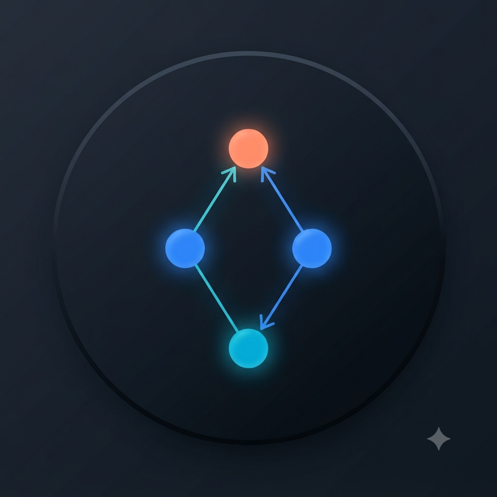
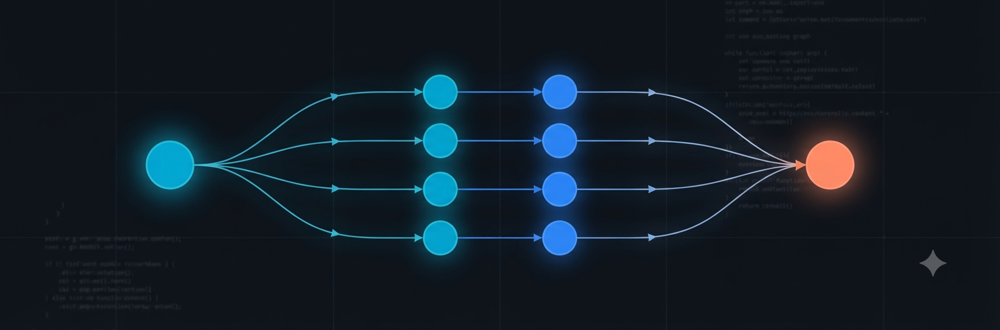
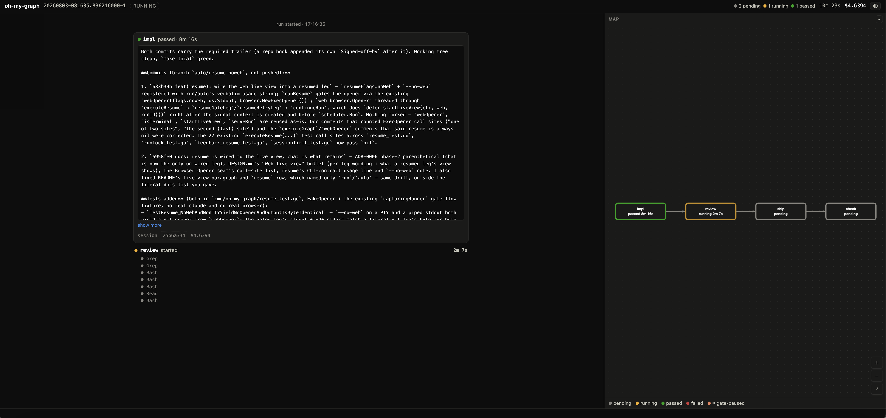

<p align="center">English | <a href="README.ko.md">한국어</a></p>

<p align="center">
  
</p>

<h1 align="center">oh-my-graph</h1>

<p align="center"><em>Each node of a graph you write runs as a real subprocess of your own <code>claude</code> or <code>codex</code> CLI — your settings, your skills.</em></p>

<p align="center">
  <a href="https://github.com/jitokim/oh-my-graph/releases"></a>
  <a href="LICENSE"></a>
  <a href="go.mod"></a>
  
</p>

<p align="center">
  
</p>

> Each node of a graph you write runs as a real subprocess of the `claude` or
> `codex` CLI you already have logged in — so it starts inside your own
> settings, CLAUDE.md, MCP servers and skills.

## What it is

You describe the work as a DAG in YAML — or hand `auto` a goal and let it plan
the graph through the same validator — and each node runs as one subprocess of
the CLI login you already use: `claude` by default, `codex` when selected for
the run. Your own logged-in CLI, not a metered API key. **That is not the same
as free.** It spends your plan allowance. [Bring your own
login](#bring-your-own-login) is how that is enforced in code, and
[docs/PRIOR-ART.md](docs/PRIOR-ART.md) is how it compares to its nearest
neighbours — conductor, OMK, open-multi-agent.

<p align="center">
  
</p>
<p align="center"><em>A real run, mid-flight. Two papers are being read and prototyped in parallel — <code>read-a → code-a</code> has finished in 37s while <code>read-b → code-b</code> is still going — because nothing in the graph says they must wait for each other. Cost and elapsed time are live in the header.</em></p>

<a id="quickstart"></a>
<a id="example"></a>

## Quickstart

```sh
# Prebuilt binary, no Go toolchain (exact commands: docs/INSTALL.md) — from https://github.com/jitokim/oh-my-graph/releases take
# oh-my-graph_<version>_<os>_<arch>.tar.gz (darwin/linux × amd64/arm64), verify it against the
# checksums.txt beside it, unpack, put it on your PATH. Or from source, with Go 1.25+ and $(go env GOPATH)/bin on PATH:
go install github.com/jitokim/oh-my-graph/cmd/oh-my-graph@latest

# Unpack the example graphs that ship inside the binary into ./graphs/:
oh-my-graph init

# Zero config — describe the goal and let auto plan the graph.
# This goal reads the repo and writes a summary: there is nothing to build,
# and --accept-no-build-evidence states that. In a directory where a build
# system IS detected, `auto` refuses to start without it or --verify-cmd,
# because a planned node cannot run a build and its PASS would be its own
# word for it:
oh-my-graph auto "lint this repo and summarize the findings" --input repo=$PWD --accept-no-build-evidence

# An implementation goal takes the other exit — the ENGINE runs your build
# command at each sink of the plan and judges its exit code itself. It runs it
# once on the starting tree first; already red there, it exits 5 (baseline red):
oh-my-graph auto "fix the failing test" --input repo=$PWD --verify-cmd 'go build ./...'

# Let the planner hear what the goal left out: up to five questions on your
# terminal first (off by default). Or end in a graph file you review and `run`:
oh-my-graph auto "fix the failing test" --input repo=$PWD --verify-cmd 'go build ./...' --interview
oh-my-graph design "fix the failing test" --out fix-test.yaml

# Codex is a run-wide opt-in; the global flag must precede the subcommand:
oh-my-graph --runtime codex auto "lint this repo and summarize the findings" --input repo=$PWD --accept-no-build-evidence

# Or run a shipped graph — the cheapest real end-to-end check (a few cents):
mkdir -p /tmp/omg-smoke
oh-my-graph run graphs/haiku-smoke.yaml --input dir=/tmp/omg-smoke

# Evidence and a human at the end: implement, engine-verified checks, a review
# with one repair round, then a pause for your approval before the PR opens
# (`oh-my-graph resume <run-id> --approve approve-publish`, or
# `--reject approve-publish`):
oh-my-graph run graphs/gated-dev.yaml --input repo="$PWD" \
  --input task="fix the failing test" --input checks="run the full test suite." \
  --input verify_command="go test ./..." --input focus="" \
  --input publish="Push this worktree's branch and open a DRAFT pull request with gh pr create --draft. Put the review in the PR body:"
```

`run` and `auto` also take `--input-file <path>` (repeatable): a flat YAML or
JSON map of input names to values, each value bound verbatim as written, as
`--input name=value` would bind it. A nested value, a list or a null is refused
before anything runs.

```yaml
# inputs.yaml
repo: /work/oh-my-graph
task: add a --json flag to runs list
```

```sh
oh-my-graph run graphs/self-dev.yaml --input-file inputs.yaml --input task="fix the flaky test"
```

A later file overrides an earlier one, and `--input` overrides every file
wherever it sits on the command line. Each key set by more than one source gets
one line on stderr naming the sources, never the value
(`input "task": --input overrides inputs.yaml`). `resume` takes the inputs from
the run's snapshot and never re-reads the file.

A bound key the graph's `inputs:` does not declare is still bound, but draws one
warning naming the key and where it came from, never the value, with a guess
when a declared name is close (`input "tsak" (from inputs.yaml) is not declared
in the graph's inputs list; it is bound anyway — did you mean "task"?`). `run`
prints it at load, `--dry-run` included. `auto` prints it on the plan screen,
`--plan-only` included, but only for a near miss of a name the planned graph
declares or references as `{{ inputs.<name> }}` in any interpolated field,
a reuse citation's `bind:` values included: the planner saw every input
and may simply not need one, so `auto "..." --input repo=$PWD` stays quiet
when the plan uses `repo` itself or no input at all. The exit status does not
change.

Engine-run evidence is established per RUN, not per node: `--verify-cmd`
attaches your command to the sinks of the plan (ADR 0030), and a planned
non-sink node carries no engine-run verify at all — its `PASS` is the
subprocess exit status and its own sentence, by construction and not by
omission. If you want an interior node checked, write your own `verify:` on it
in a hand-written graph and run it with `run` (ADR 0033).

Log in once with the selected CLI (`claude` or `codex login`). No API key is
needed: Anthropic and OpenAI API-key variables are deleted from child process
environments so the CLI uses its saved login. The default remains Claude;
`--runtime codex` applies to the whole run, is saved in `state.json`, and is
reused by `resume` and browser gate actions. Add `--plan-only` to `auto` to buy
the plan and read it without executing a node. It saves the plan as
`graph.json` and, beside it, as `graph.yaml`: edit the YAML (to add a human
gate, a `type: gate` node with its `depends_on`) and `run` that file.

Codex maps `permission_mode: plan` to its read-only sandbox, ordinary modes to
`workspace-write`, and `bypassPermissions` to `danger-full-access`. That sandbox
is also a network boundary, so a Codex graph halts at its first node that
pushes or calls `gh`. Codex does
not report USD or implement Claude's `agent:` selector, so `agent:` and
`--max-goal-budget-usd` are rejected before a Codex run spends anything; the
ledger labels its USD cost `unknown` rather than inventing `$0`. A
node's `budget_usd` is not rejected: with no USD to bound it simply cannot
apply, so the graph loads and one warning per node says so and names the
`timeout:` that still guards it. Claude Code agent mapping and skill
activation are Claude-only; Codex `auto` runs use Codex sandbox isolation
instead.

You get a live line per node as the graph runs, then a cost ledger:

```text
Run 20260729-101532 — 2 node(s)
NODE             VERDICT              SESSION           COST(USD)  DETAIL
-------------------------------------------------------------------------
critique         PASS (exit-only)     a1b2c3d4-e5f6-4…     0.0034
write            PASS (verified)      f9e8d7c6-b5a4-4…     0.0091
-------------------------------------------------------------------------
TOTAL COST: $0.0125
```

Every `PASS` says **how** it was reached, because "the engine ran your build and
it exited 0" and "the model said the word PASS" are not the same claim and must
not print as the same word. `exit-only` above means nothing beyond the exit
status was checked. The closed set of four qualifiers, and what the engine
actually did for each, is in [Reading the
ledger](docs/EXAMPLES.md#reading-the-ledger--what-a-pass-says).

## The graph is a file, not a transcript

The DAG lives in YAML you version, review in a pull request and replay — the
same topology, the same prompts every time. That is the opposite of an agent
improvising a fresh plan on every invocation.

```yaml
name: dev-review-pr
inputs: [repo]
concurrency: 4
nodes:
  - id: dev
    cwd: "{{ inputs.repo }}"
    prompt: Implement the change and summarize what you did.
    allowed_tools: [Read, Edit, Write, "Bash(git *)"]
    permission_mode: dontAsk  # optional; undeclared is `auto`, this asks for stricter

  - id: e2e
    depends_on: [dev]
    cwd: "{{ inputs.repo }}"
    handoff: session          # e2e resumes dev's session — it already knows what dev did
    prompt: Run make local. Reply with the bare word PASS, or FAIL and what broke.
    success_check:
      exit_zero: true
      result_matches: '^[*_`\s]*PASS[*_`\s]*$'   # what the node said
      verify: { command: "make local" }          # what the engine saw
    retry: { max: 1, on: [nonzero_exit, verify_failed] }

  - id: review
    depends_on: [e2e]
    permission_mode: plan     # read-only
    allowed_tools: [Read, "Bash(git diff*)"]
    prompt: "Review the diff. e2e said: {{ artifacts.e2e | inline }}"
```

Edges are inline `depends_on` ids — there is no separate edge list — and
parallelism is **emergent**: nodes that share a parent but don't depend on each
other run concurrently, up to a cap. `allowed_tools` is the node's own grant,
not a hint. And failure is a first-class grammar rather than glue code you
maintain: evidence checks, per-cause `retry`, graph-level `on_fail`, bounded
`feedback:` review loops, `type: gate` nodes that stop the run for a human
approval, and a subscription session limit — Claude's or Codex's — that *pauses* the run so
`resume --retry-failed` can later finish exactly the work that never ran.

Every subcommand, every flag, and a recipe per node field — including `auto` in
depth, its goal cycles, and how it maps planned nodes onto your own Claude Code
agents and skills — are in [docs/EXAMPLES.md](docs/EXAMPLES.md). DESIGN.md is
the authoritative spec.

## Watching it, and what it leaves behind

`run`, `auto` and `resume` serve the live view above on `127.0.0.1` for as long
as the leg lasts and open it in your browser (`--no-web` opts out). `oh-my-graph
serve` with no run id is a **dashboard** of every run at once, one live mini-DAG
card each; `runs list` / `show` / `watch` are the plain-text reads afterward.

Every run persists to `~/.oh-my-graph/runs/<run-id>/` (`OMG_HOME` relocates the
base): a `state.json` snapshot and an append-only `events.jsonl` that any
external consumer can tail. That layout, and how a live run is told from one
whose process died, are a documented, stable contract —
[docs/RUN-FEED.md](docs/RUN-FEED.md); the six run statuses `runs list` prints
are listed with the rest of the command surface in
[docs/EXAMPLES.md](docs/EXAMPLES.md#the-command-surface). Nodes also run with
session persistence **on**. Claude nodes remain ordinary sessions in
`~/.claude/projects`; Codex nodes persist and resume the thread id emitted by
`codex exec --json`.

## It ships itself

Dogfooding here is not a demo: this repository is built by the tool it contains.
Features, fixes, docs and releases are authored by its own graphs — a claude
node implements on a branch, sibling nodes run the checks and the reviews, a
review finding sends the work back to the implementer, and a final node opens
the draft PR. The templates in [`graphs/`](graphs/) are not
samples; `self-dev.yaml`, `adr-driven-dev.yaml` and `apply-flags.yaml` are those
pipelines. Don't take that on trust: the commit trailers that make it
countable, the one-line audit command, and its denominator are in
[CONTRIBUTING.md § Attribution](CONTRIBUTING.md#attribution), and a full
dogfooding run is walked through in
[docs/EXAMPLES.md](docs/EXAMPLES.md#dogfooding-developing-oh-my-graph-with-oh-my-graph).

## One boundary to read before you trust it

`auto` executes a plan an LLM wrote, unattended, on your machine. oh-my-graph
bounds planned execution using the selected runtime's mechanism. Claude uses
the measured layered tool ceiling described below; Codex discards user config,
project rules/AGENTS files and MCP servers for planned nodes, then applies its
read-only or workspace sandbox. **These are reductions, not a security
boundary around the repository you launched from.** Run `auto` only in a
directory you are willing to have modified. Both are scoped to planned nodes:
a hand-written graph you launch with `run` keeps your user config, project
rules/AGENTS files, hooks and MCP servers, and `--accept-loaded-user-config`
states out loud that you want them under `auto` too.

One preference crosses that line by name, and only that one: the `model` key of
your `~/.claude/settings.json` is read on its own and passed to a planned Claude
node as `--model <value>`, so it answers with the model **you** chose instead of
whatever the CLI falls back to when its settings are withheld (measured: 181 of
187 planned nodes ran a model nobody selected —
[ADR 0037](docs/adr/0037-a-planned-node-answers-with-the-model-the-operator-chose.md)).
The node's capability ceiling is unchanged by it: a model name grants no tool,
loads no file and runs no hook. Nothing else in that file is read, and under
`--runtime codex` nothing is.

Your coding conventions can cross it too, as **text**, when you name them:
`auto --conventions <path>` (repeatable) reads each file at launch, stages the
concatenation into the run directory, and prefixes it to the prompt of every
planned node that does not resume a session — on either runtime
([ADR 0041](docs/adr/0041-an-operators-conventions-reach-a-planned-node-as-text-not-as-settings.md)).
No setting, grant, hook or MCP server comes with the text, so the ceiling,
agent mapping and skill activation are exactly what they are without the flag.
`@` imports are not followed — name the imported files instead, and a file that
is only imports is refused with the list to pass. The rendered prefix is capped
at 96 KiB — under Linux's 128 KiB limit on one argv string, which the prompt
is — and never truncated. A full-size prefix leaves a node's own prompt about
32 KiB of that limit; a larger one (a big `| inline` artifact) fails to spawn on
Linux with `E2BIG` mid-run, not at launch. Like the rest of a prompt, the text is readable from
the process table while a node runs (SECURITY.md). The plan screen prints each path and hash;
`--plan-only` says the conventions are not in the saved graph, because
`run <graph.yaml>` does not carry them.

What the goal left out can reach the **planner** as text, when you ask to be
asked: `auto --interview` (off by default) puts at most five questions to you
on the terminal before the first planner call — each one a read-only
interviewer call with no tools, counted in cycle 1's planning cost and the
goal's spend — and refuses before any model call when stdin is not a terminal.
`/skip` skips a question and `/done` stops. Your answers are untrusted text, so
they reach the planner inside a nonce fence labelled as data, reach no planned
node, and change no setting, grant or tool. It is asked once per goal, not per
cycle; each run directory stages the answers as `interview.md` with their hash
in `state.json`, and `resume` refuses a run whose copy is missing or altered.
It works with `--plan-only`, which keeps the answers beside the saved spec.
`oh-my-graph design "<goal>" --out <file>` is the same interview ending in a
file instead of a run: one planner call, the graph written as YAML, the
`lint` check on it — and nothing runs. It refuses an existing `--out` and
`--conventions`, and keeps a file that does not lint
([ADR 0044](docs/adr/0044-an-interview-before-planning-is-opt-in-text-for-the-planner-and-never-a-gate.md)).

One thing inside that ceiling changed recently and is worth knowing before you
read the layers. A node that declares no `permission_mode` runs under
`--permission-mode auto`, where it used to run `dontAsk`: a tool call matching
none of the node's allow rules is now put to the CLI's own model classifier,
which approves or denies it, rather than being denied outright. The tool grants
themselves did not move — a declared `Bash(git *)` is still exactly what is
passed, an explicit deny still wins ahead of the classifier, and a tool left out
of the node's set still does not exist. Write `permission_mode: dontAsk` on a
node to get the stricter disposition back. The reasoning, and the measurement
that would reverse it, are in
[ADR 0034](docs/adr/0034-an-unmatched-tool-call-meets-a-classifier-not-a-dead-ask.md).

The layer-by-layer stance and every measurement behind it are in
[SECURITY.md](SECURITY.md); the rest of the honest gaps, the platform support
matrix (macOS and Linux supported, WSL first-class, native Windows best-effort)
and what is deliberately deferred are in
[docs/LIMITATIONS.md](docs/LIMITATIONS.md).

## Bring your own login

oh-my-graph never ships credentials, never proxies auth, and never runs as a
shared service. It re-uses **your own** saved `claude` or `codex` login. It is a
personal, local tool with the same standing as invoking the selected CLI
yourself.

To keep that guarantee real, every node subprocess starts from your environment
with `ANTHROPIC_API_KEY`, `ANTHROPIC_AUTH_TOKEN`, `OPENAI_API_KEY`, and
`CODEX_API_KEY` **deleted** — those can switch the selected CLI away from its
saved login. The scrub is one shared policy
(`internal/childenv`), unit-tested on its own and again at each of the four exec
seams; oh-my-graph never uses `--bare` (which disables OAuth) and never touches
the Agent SDK. Full stance: [SECURITY.md](SECURITY.md).

## Where the rest lives

| you want | read |
|---|---|
| every subcommand and flag, walkthroughs, a recipe per node field, `auto` in depth | [docs/EXAMPLES.md](docs/EXAMPLES.md) |
| prebuilt binaries, checksum verification, what `init` unpacks | [docs/INSTALL.md](docs/INSTALL.md) |
| the honest gaps, platform support, what is deferred | [docs/LIMITATIONS.md](docs/LIMITATIONS.md) |
| the run directory, `events.jsonl`, run statuses and liveness | [docs/RUN-FEED.md](docs/RUN-FEED.md) |
| the ToS stance, auto's tool ceiling, what was measured | [SECURITY.md](SECURITY.md) |
| the authoritative spec | [DESIGN.md](DESIGN.md) |
| building, testing, the attribution trailer, the release checklist | [CONTRIBUTING.md](CONTRIBUTING.md) |
| how it compares to conductor, OMK, open-multi-agent | [docs/PRIOR-ART.md](docs/PRIOR-ART.md) |
| driving it from inside a Claude Code session | [plugin/README.md](plugin/README.md) |

See also: [fleetops](https://github.com/jitokim/fleetops), a sibling project
that reads the same `~/.claude/projects` transcripts fleet-wide.

## License

[MIT](LICENSE) © jitokim
